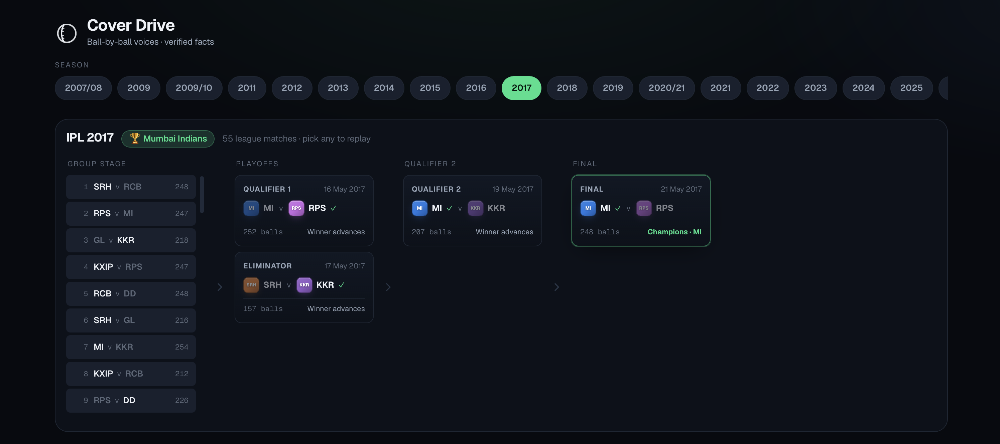
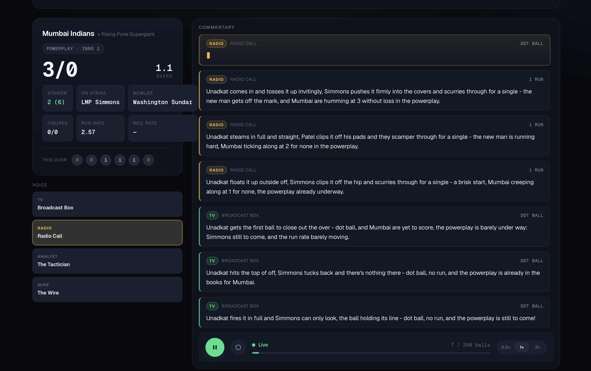
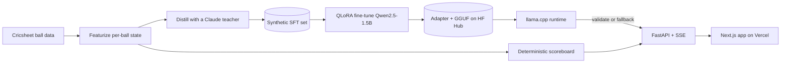

# 🏏 Cover Drive

**A small language model, fine-tuned to commentate cricket ball by ball in switchable
broadcast voices. Deployed live, generating real commentary, and built so it can never get a
fact wrong.**

### ▶ [Live demo](https://cover-drive-phi.vercel.app)

> It runs on a free CPU host, so the first ball takes a few seconds to warm up. That delay is
> the real fine-tuned model spinning up, not a loading screen.



## What it is

Pick any IPL match from 19 seasons, press play, and watch it replay one delivery at a time.
The scoreboard advances, and a fine-tuned language model writes the commentary live, token by
token. Switch the voice (Broadcast, Radio, Analyst, or Wire) and the same ball re-narrates in
a completely different style.

The idea that makes it interesting: **the model is never allowed to state a fact.** Every
number and name (the score, the run rate, who is bowling) is supplied deterministically from
the structured ball data. The model only writes the *voice* around facts it is handed, so it
physically cannot hallucinate a wrong score, and any line that contradicts the data is caught
and replaced before it reaches the screen.

That separation is the real point. It is a reusable blueprint for putting a language model in
front of users in any domain where it must not get the facts wrong (financial summaries,
medical notes, automated reporting), with correctness enforced by the system rather than left
to the model's good behavior. Cricket is just a vivid way to show it working.



## The headline result

The commentator is a **fine-tuned Qwen2.5-1.5B** (QLoRA), distilled from a Claude teacher on a
synthetic, clean-license dataset built for the project. On 151 held-out deliveries it never
trained on, it beats the base model decisively on factual faithfulness:

| Model                | Faithfulness | Style variety                        |
| -------------------- | ------------ | ------------------------------------ |
| Base Qwen2.5-1.5B    | 82.8%        | reference                            |
| **This fine-tune**   | **94.0%**    | healthy (distinct-2 0.55, no repeats) |

That is a +11.3 point jump, past the gate set before any product work was allowed to begin. A
hand audit showed the true number is higher still: most of the remaining flags are quirks of
the heuristic checker, not the model. The whole dataset and training run cost about **$25 of
API credit and a free Colab GPU.**

## What this project demonstrates

- **End-to-end ownership.** One person, the whole pipeline: data engineering, synthetic-data
  generation, model fine-tuning, evaluation, a streaming API, a polished web app, and a live
  public deployment.
- **A hard problem solved properly.** LLM factual reliability is handled by architecture
  (separate the facts from the voice, then validate) rather than by hoping the prompt holds.
- **Pragmatic and cost-aware.** A 1.5B model fine-tuned to carry a much larger teacher's voice,
  for about $25 of API credit on free GPUs, then hosted for free. Small, cheap, and good
  enough to ship.
- **Production discipline.** Built in eight gated phases with red-team reviews, strict typing,
  about 93% test coverage, and CI, so it reads like a system, not a notebook.

## How it works



1. **Data.** Cricsheet ball-by-ball records become a per-ball match state (score, rates,
   partnerships, milestones, phase).
2. **Distill.** A Claude teacher writes commentary for each state, filtered hard for
   faithfulness to produce a clean synthetic training set.
3. **Fine-tune.** QLoRA on Qwen2.5-1.5B (a free Colab T4), then a held-out gate decides
   whether it is good enough to ship.
4. **Serve.** FastAPI streams commentary over Server-Sent Events; the scoreboard is rendered
   from the data; every line is validated against the ground truth with a guaranteed-faithful
   fallback.
5. **Ship.** A Next.js app on Vercel, with the model live as a quantized GGUF on a free
   Hugging Face CPU Space.

## Built with

`Python` · `PyTorch` · `QLoRA / Unsloth` · `Hugging Face` · `llama.cpp` · `FastAPI` ·
`Server-Sent Events` · `Next.js + TypeScript` · `Vercel` · `uv / ruff / mypy / pytest`

## Under the hood

Built as eight gated phases, each red-teamed, tested, and documented. The Python side runs
**strict mypy, ruff, and about 93% test coverage** in CI; the model is dependency-inverted
behind a runtime protocol, so the same serving code runs the GPU training stack, a CPU GGUF,
or a no-model stub for tests. The facts-versus-voice guarantee is enforced at three layers:
when the training data is generated, during evaluation, and at serving time.

## Run it locally

```bash
make serve ARGS="--stub"             # API with a stub runtime (no model, no GPU)
cd web && pnpm install && pnpm dev   # then open http://localhost:3000
```

For the real model locally (Apple Silicon uses MPS):

```bash
uv pip install torch peft accelerate safetensors
make serve                           # serves the fine-tuned model
```

## Disclaimer and attribution

Personal, non-commercial, educational project. Not affiliated with or endorsed by the BCCI,
the Indian Premier League, or any franchise. Team names are used only to identify real
matches; no trademarked logos are bundled (teams render as generated monogram crests).

- Match data: [Cricsheet](https://cricsheet.org/), used with attribution per its license.
- Base model: Qwen2.5-1.5B-Instruct (Apache 2.0).
- The commentary training data is synthetic (generated for this project); no third-party
  commentary corpus is redistributed.

## License

MIT for the code in this repository. Model and dataset artifacts carry their own licenses;
see their cards on the Hugging Face Hub.
