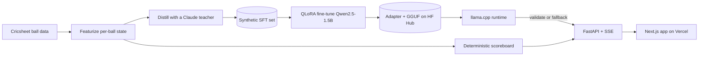

# Cricket Commentary Voice Engine

A fine-tuned small language model that narrates a cricket match ball by ball in a
chosen commentary voice, served as a web app that replays historic matches with
the commentary streaming live.

The governing invariant: the model generates voice only. Every fact (names,
scores, runs, wickets, rates) is supplied deterministically from structured ball
data and is never generated by the model. The model produces the stylistic
wrapper around facts it is handed.

It covers all 19 IPL seasons (2008 to 2026) as selectable brackets; out of scope:
retrieval/QA chatbots, live match ingestion, and match-outcome prediction. This is a
generation-and-style project.

## Live demo

- **App:** https://cover-drive-phi.vercel.app
- **Model API** (the fine-tuned Qwen2.5-1.5B served as a quantized GGUF on a free Hugging
  Face CPU Space): https://kattymandy-cover-drive-api.hf.space

Pick a season, open a match, press play. The scoreboard advances instantly from the
structured data; the commentary is generated **live by the fine-tuned model** (the first
ball warms up the free CPU, so give it a moment). Switch the voice to watch the fine-tune
change style while the facts stay fixed.

## Architecture

Cricsheet structured ball data is ground truth. A Claude teacher, few-shot seeded with real
commentary, distills `(match-state, commentary)` pairs into a synthetic SFT set. A Qwen2.5
student is fine-tuned with QLoRA to own the voice. A FastAPI serving layer fills names and
numbers deterministically so displayed facts are always correct, and a Next.js app replays a
match delivery by delivery.



## Repository layout

```
app/        library code: cricsheet, features, distill, dataset, train, eval, serve
configs/    typed pydantic-settings models, match lists, run configs
scripts/    idempotent CLI entrypoints keyed on (match_id, ball_id)
tests/      unit + integration
web/        Next.js + TypeScript replay app (talks to the model over the serving API only)
infra/      training (RunPod) + deploy (the Hugging Face Space Dockerfile and entry)
docs/       architecture, ADRs, per-phase specs, progress log
```

## Requirements

- Python 3.12 and [uv](https://docs.astral.sh/uv/)
- Node 22+ and pnpm (via `corepack enable pnpm`)

## Setup

```bash
# Python environment and git hooks
make setup            # uv sync --locked + pre-commit install

# Secrets (none required for the scaffold; filled in for later phases)
cp .env.example .env

# Web app
cd web && pnpm install && cd ..
```

## Development gates

```bash
make check            # ruff lint + format check, mypy strict, pytest with coverage
make web-check        # web: install + lint + build
```

Both gates also run in CI on every push and pull request
(`.github/workflows/ci.yml`).

## Serving

The serving layer replays a bundled match ball by ball and streams commentary over
Server-Sent Events. It holds the model behind a runtime seam, renders every displayed
fact from the structured record, and validates each generated line against that ground
truth, substituting a deterministic, faithful line if a draw ever contradicts the facts.
A line that misstates a fact never reaches the client.

```bash
make serve-smoke              # headless: stream one bundled match to stdout (no model, no GPU)
make serve ARGS="--stub"      # run the API with a stub runtime (no model) for frontend dev
make serve                    # run the API with the real model (transformers + peft)
```

The stub runtime needs nothing extra and emits one fixed placeholder line (it proves the
pipeline). The real model (`make serve`) needs the local inference deps once, kept out of
the locked dependencies so the default install stays lean:

```bash
uv pip install torch peft accelerate safetensors
```

First real run downloads the base model (~3GB) and the adapter, then both are cached. On
Apple Silicon it serves fp16 on MPS.

Endpoints: `GET /matches`, `GET /matches/{id}`, `GET /personas`, and the replay stream
`GET /matches/{id}/stream?persona=broadcast` (SSE: a `state` event per delivery, then
`token` events, then a `ball` event with the validated line and its provenance).

## Web app

A Next.js match-center (`web/`) replays a bundled match ball by ball: the scoreboard
advances one delivery at a time, commentary streams token by token, and a persona switcher
re-renders the same passage in another voice. It talks to the serving API only over
HTTP/SSE (`NEXT_PUBLIC_API_BASE`, default `http://localhost:8000`).

```bash
make serve ARGS="--stub"      # 1. start the API with a stub runtime (no model needed)
cd web && pnpm install && pnpm dev   # 2. then open http://localhost:3000, press play
```

Teams render as colored monogram crests by default (no trademarked logos are bundled). To
use real artwork you have the right to use, drop `web/public/teams/<CODE>.png` files (codes
like `CSK`, `RCB`, `SRH`) and set `NEXT_PUBLIC_TEAM_LOGOS=1`; the badge renders the image and
falls back to the crest if a file is missing.

## Results (Phase 5 gate, 151 held-out balls)

The fine-tune is scored on 151 deliveries from validation-split matches it never saw,
generated across all four voices and checked by the heuristic faithfulness checker plus
diversity metrics:

| System     | Faithfulness | distinct-2 | self-dup |
| ---------- | ------------ | ---------- | -------- |
| Base Qwen  | 82.8%        | 0.69       | 0.00     |
| Fine-tuned | 94.0%        | 0.55       | 0.00     |

Gate: **PASS** (+11.3% faithfulness over base, margin 5%; diversity healthy). A hand audit
showed the fine-tune's remaining flags are mostly checker false positives (run-rate "six an
over", balls-remaining "six balls"), so true faithfulness is higher, while the base model's
flags are mostly real hallucinations. The heuristic was then hardened against those
false-positive classes, and the same checker guards serving output at runtime.

## Status

Complete and deployed. The fine-tune passed the training gate, the serving layer enforces
the facts-versus-voice invariant at runtime, the web app replays every IPL season as a
bracket, and the whole thing is live on Vercel plus a free Hugging Face CPU Space (see Live
demo above). Built in gated phases 0 to 8.

## License

MIT. See the model and dataset cards on the Hugging Face Hub for artifact
licensing once published.
